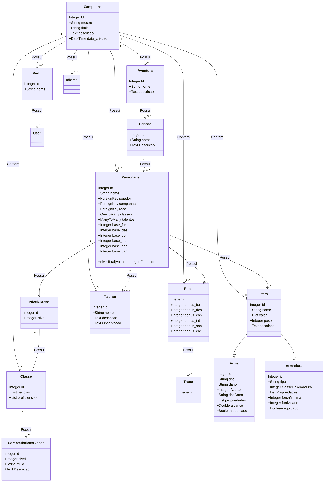

# Sistema de gerenciamento de personagens de rpg utilizando Django

Renderizado usando TYPORA

```mermaid
classDiagram
	Campanha "1" --> "0..*" Aventura : Possui
	Campanha "1" --> "1..*" Perfil : Possui
	Campanha "1" --> "0..*" Classe : Contem
	Campanha "1" --> "0..*" Raca : Contem
	Campanha "1" --> "0..*" Item : Contem
	Campanha "11" --> "0..*" Personagem : Possui
	Campanha "1" --> "0..*" Talento : Possui
	Campanha "1" --> "1..*" Idioma : Possui
	
	Aventura "1" --> "0..*" Sessao : Possui
	Sessao "1..*" --> "1..*" Personagem : Possui
	
	Raca "1" --> "0..*" Traco : Possui
	
	Personagem "0..*" --> "1" Raca : Possui
	Personagem "1" --> "1..*" NivelClasse : Possui
	Personagem "0..*" --> "0..*" Talento : Possui
	Personagem "0..1" --> "0..*" Item : Possui
	NivelClasse "0..*" --> "1" Classe : Possui
	
	Perfil "1" --> "1" User : Possui
	
	class Campanha {
		Integer Id
		+String mestre
		+String titulo
		+Text descricao
		+DateTime data_criacao
	}
	
	class Aventura {
		Integer Id
		+String nome
		+Text descricao
	}
	
	class Sessao {
		Integer Id
		+String nome
		+Text Descricao
	}
	
	class Raca {
		Integer Id
		+Integer bonus_for
		+Integer bonus_des
		+Integer bonus_con
		+Integer bonus_int
		+Integer bonus_sab
		+Integer bonus_car
	}
	
	class Classe {
		Integer id
		+List<String> pericias
		+List<String> proficiencias
	}
	
	Classe "1" --> "0..*" CaracteristicasClasse : Possui
	class CaracteristicasClasse {
		Integer id
		+Integer nivel
		+String titulo
		+Text Descricao
	}
	
	class NivelClasse {
		Integer id
		+Integer Nivel
	}
	
	class Perfil {
		Integer Id
		+String nome
	}
	
	class Personagem {
		Integer Id
		+String nome
		+ForeignKey<User> jogador
		+ForeignKey<Campanha> campanha
		+ForeignKey<Raca> raca
		+OneToMany<ClassePersonagem> classes
		+ManyToMany<Talento> talentos
		+Integer base_for
		+Integer base_des
		+Integer base_con
		+Integer base_int
		+Integer base_sab
		+Integer base_car
		+nivelTotal(void): Integer // metodo
	}
	
	class Item {
		Integer Id
		+String nome
		+Dict valor
		+Integer peso
		+Text descricao
	}
	
	Item --|> Arma
	class Arma {
		Integer id
		+String tipo
		+String dano
		+Integer Acerto
		+String tipoDano
		+List<String> propriedades
		+Double alcance
		+Boolean equipado
	}
	Item --|> Armadura
	class Armadura {
		Integer id
		+String tipo
		+Integer classeDeArmadura
		+List<String> Propriedades
		+Integer forcaMinima
		+Integer furtividade
		+Boolean equipado
	}
	
	class Talento {
		Integer Id
		+String nome
		+Text descricao
		+Text Observacao
	}
	
	class Traco {
		Integer Id
	}
```

 Lembrar:

* Items = ManyToMany com unique = true ?
* Talentos = ManyToMany unique true